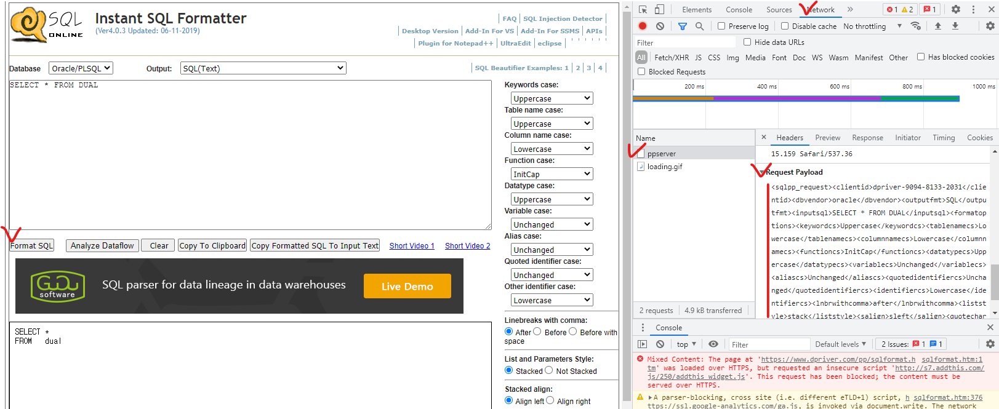

# Instant SQL Formatter
format your query with options<br>
Reference : https://www.dpriver.com/pp/sqlformat.htm

## How to Use
```javascript
const formatter = require("instant-sql-formatter")

function basicFunction() {
	let vQuery = "select * from dual"

	formatter.format(vQuery).then(res=>{
		console.log(res)
	})
}

async function asyncFunction() {
	let vQuery = "select * from dual"
	let vConvQuery = await formatter.format(vQuery)
	console.log(vConvQuery)
}
```
* Input
```
select * from dual
```
* Output
```
 SELECT *
  FROM DUAL 
```

## Variable Options
```javascript
let options = {
	dbvendor      : "oracle",          // endor, access, db2, mssql, mysql, oracle, mdx, generic
	outputfmt     : "SQL",             // htmlkeeplayout, htmlkeeplayout2, htmlkeeplayoutmodifycase, htmlkeeplayout2modifycase, txtmodifycase, C#, C# String Builder, Delphi, Java, Java String Buffer, PHP, VB, VBSBD, VC, dbobject, proc, procobol, xml
	keywordcs     : "Uppercase",       // Uppercase,Lowercase,InitCap,Unchanged,initcapeachword
	tablenamecs   : "Uppercase",       // Uppercase,Lowercase,InitCap,Unchanged,initcapeachword
	columnnamecs  : "Uppercase",       // Uppercase,Lowercase,InitCap,Unchanged,initcapeachword
	functioncs    : "Uppercase",       // Uppercase,Lowercase,InitCap,Unchanged,initcapeachword
	datatypecs    : "Uppercase",       // Uppercase,Lowercase,InitCap,Unchanged,initcapeachword
	variablecs    : "Uppercase",       // Uppercase,Lowercase,InitCap,Unchanged,initcapeachword
	aliascs       : "Uppercase",       // Uppercase,Lowercase,InitCap,Unchanged,initcapeachword
	quotedidentifiercs : "Uppercase",  // Uppercase,Lowercase,InitCap,Unchanged,initcapeachword
	identifiercs  : "Uppercase",       // Uppercase,Lowercase,InitCap,Unchanged,initcapeachword     
	lnbrwithcomma : "beforewithspace", // after,before,beforewithspace
	liststyle     : "stack",           // stack,nostack
	salign        : "sright",          // sleft,sright
	quotechar     : "\"",
	maxlenincm    : "80"
} -- default setting
```
### Sample(TEXT)
```javascript
let vQuery = "select * from dual"
let vConvQuery = await formatter.format(vQuery, { dbvendor:"oracle", lnbrwithcomma:"after", salign:"sright"} )
```
* Input
```
select * from dual
```
* Output
```
 SELECT *
  FROM DUAL 
```

### Sample(HTML Tag Options)
```javascript
let vQuery = "select * from dual"
let vConvQuery = await formatter.format(vQuery, { outputfmt:"htmlkeeplayout"} )
```

* Input
```
select * from dual
```
* Output
```
<div><span style="font-family: Courier New; font-size: 10pt;">
<span style="color: blue; ">SELECT</span>&nbsp;<span style="color: silver; ">*</span>
<br/>&nbsp;&nbsp;<span style="color: blue; ">FROM</span>&nbsp;<span style="color: maroon; ">DUAL</span>&nbsp;
</span></div>
```


## TIP! Easily create options 
1. Visit the Website(https://www.dpriver.com/pp/sqlformat.htm) and select options what you want
2. Analyze transactions using developer tools.
3. Edit appropriately.


